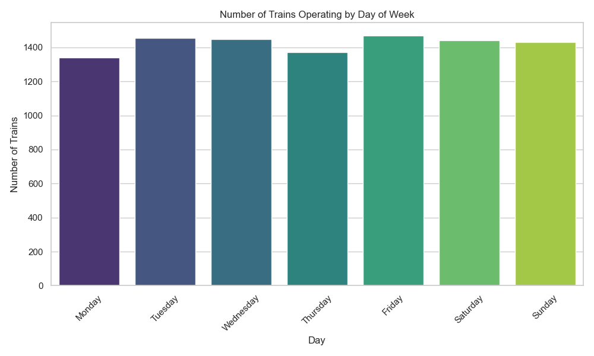
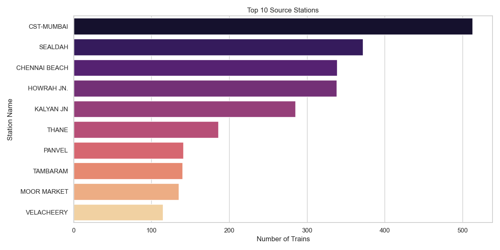
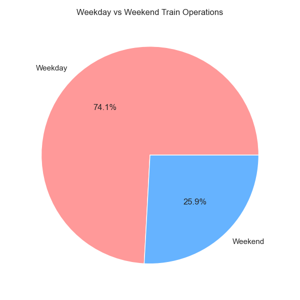

# Railway Analysis Report

## Level 1: Data Exploration

### Task 1.1: Data Structure
- **Shape**: (11113, 5)
- **Columns**: Train_No, Train_Name, Source_Station_Name, Destination_Station_Name, days
#### First 5 Rows
|   Train_No | Train_Name   | Source_Station_Name   | Destination_Station_Name           | days      |
|-----------:|:-------------|:----------------------|:-----------------------------------|:----------|
|        107 | SWV-MAO-VLNK | SAWANTWADI ROAD       | MADGOAN JN.                        | Saturday  |
|        108 | VLNK-MAO-SWV | MADGOAN JN.           | SAWANTWADI ROAD                    | Friday    |
|        128 | MAO-KOP SPEC | MADGOAN JN.           | CHHATRAPATI SHAHU MAHARAJ TERMINUS | Friday    |
|        290 | PALACE ON WH | DELHI-SAFDAR JANG     | DELHI-SAFDAR JANG                  | Wednesday |
|        401 | BSB BHARATDA | AURANGABAD            | VARANASI JN.                       | Saturday  |

### Task 1.2: Basic Statistics
- **Total Trains**: 11113
- **Unique Source Stations**: 921
- **Unique Destination Stations**: 924
- **Most Common Source**: CST-MUMBAI
- **Most Common Destination**: CST-MUMBAI

### Task 1.3: Data Cleaning
#### Missing Values:
|                          |   0 |
|:-------------------------|----:|
| Train_No                 |   0 |
| Train_Name               |   0 |
| Source_Station_Name      |   0 |
| Destination_Station_Name |   0 |
| days                     |   0 |

- Station names have been standardized to uppercase.

## Level 2: Data Transformation

### Task 2.1: Filtering
- **Trains operating on Saturday**: 1441
### Task 2.2: Top 10 Source Stations by Train Count
| Source_Station_Name   |   Train_Count |
|:----------------------|--------------:|
| CST-MUMBAI            |           513 |
| SEALDAH               |           372 |
| CHENNAI BEACH         |           339 |
| HOWRAH JN.            |           338 |
| KALYAN JN             |           285 |
| THANE                 |           186 |
| PANVEL                |           141 |
| TAMBARAM              |           140 |
| MOOR MARKET           |           135 |
| VELACHEERY            |           115 |

#### Average Trains per Day (Top 5 Sources)
| Source_Station_Name   |   Avg_Trains_Per_Day |
|:----------------------|---------------------:|
| CST-MUMBAI            |              51.3    |
| SEALDAH               |              41.3333 |
| KALYAN JN             |              40.7143 |
| HOWRAH JN.            |              30.7273 |
| THANE                 |              26.5714 |

### Task 2.3: Data Enrichment
- Added `Day_Category` column (Weekday/Weekend).
| Day_Category   |   count |
|:---------------|--------:|
| Weekday        |    8240 |
| Weekend        |    2873 |

## Level 3: Advanced Analysis

### Task 3.1: Weekly Distribution
| days      |   count |
|:----------|--------:|
| Monday    |    1342 |
| Tuesday   |    1454 |
| Wednesday |    1448 |
| Thursday  |    1372 |
| Friday    |    1471 |
| Saturday  |    1441 |
| Sunday    |    1432 |

## Level 4: Visualizations

